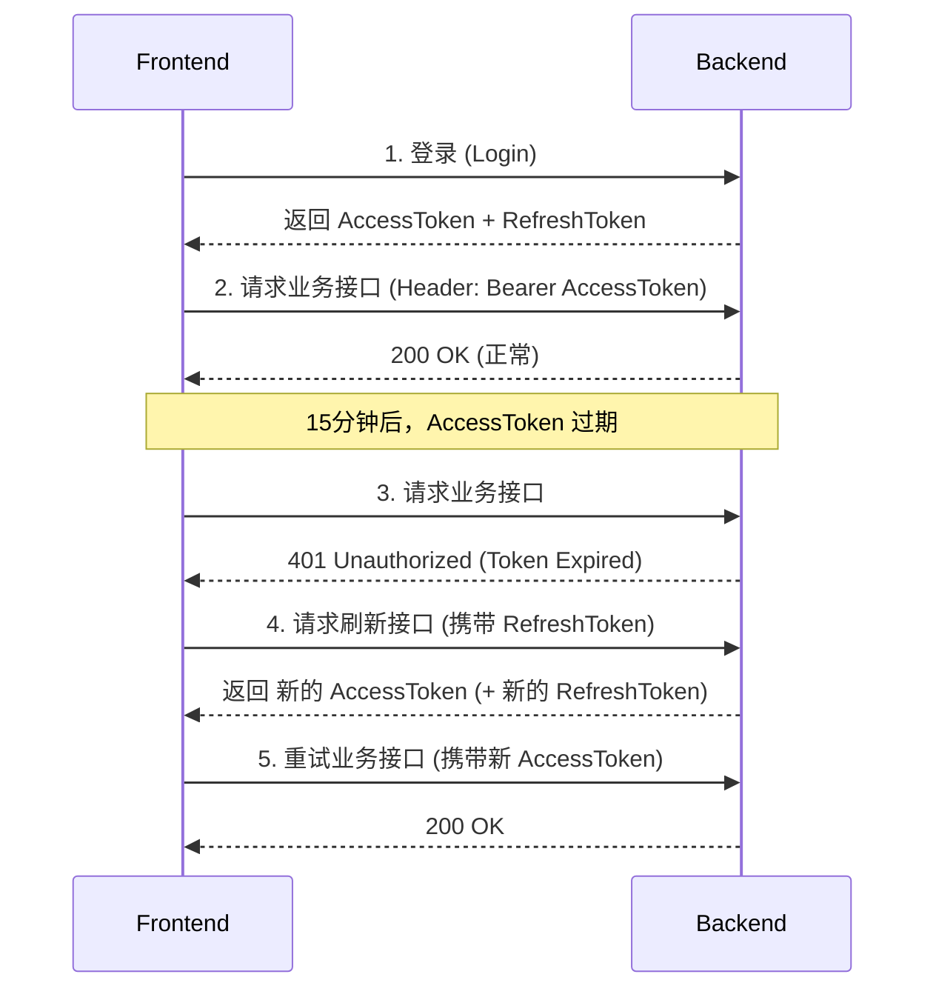

# 12. 实战一：用户认证与 JWT 刷新机制

## 引言

在第 5 章中，我们实现了一个简单的 JWT 登录功能。但在企业级应用中，简单的 JWT 存在两个严重问题：

1.  **续期问题**：Token 一旦签发，过期时间就固定了。如果设置太短（如 15 分钟），用户体验极差（频繁登录）；如果设置太长（如 7 天），一旦 Token 泄露，黑客有 7 天的时间为所欲为。
2.  **废止问题**：JWT 是无状态的。用户修改密码、管理员封禁账号、或者用户点击"退出登录"后，旧的 Token 依然有效，直到它自然过期。

本章我们将通过 **双令牌机制 (Access + Refresh Token)** 和 **Redis 黑名单** 来彻底解决这两个问题。

## 1. 双令牌机制原理

我们向前端返回两个 Token：

1.  **Access Token**:
    -   **有效期**: 短（如 15 分钟 - 2 小时）。
    -   **作用**: 访问业务接口。
    -   **载荷**: 包含用户 ID、角色等关键信息。
2.  **Refresh Token**:
    -   **有效期**: 长（如 7 天 - 30 天）。
    -   **作用**: **仅用于**换取新的 Access Token。
    -   **存储**: 建议前端存在 `HttpOnly Cookie` 中（防止 XSS），或者 LocalStorage（如果非要存的话）。

**流程图：**



**前端视角 (Axios Interceptor)**:
前端同学通常会在 Axios 的响应拦截器中处理这个逻辑：拦截到 401 -> 暂停请求 -> 调用刷新接口 -> 拿到新 Token -> 更新 Header -> 重发原请求。这对用户是**无感**的。

## 2. 后端实现

### 2.1 更新 JWT 工具类

修改 `pkg/util/jwt.go`，支持生成两种 Token。

```go
package util

import (
	"time"
	"github.com/golang-jwt/jwt/v5"
)

// ... 原有的 Claims 定义 ...

// GenerateTokens 生成双令牌
func GenerateTokens(userID uint, username string) (accessToken, refreshToken string, err error) {
	// 1. 生成 Access Token (1小时)
	accessClaims := Claims{
		UserID:   userID,
		Username: username,
		RegisteredClaims: jwt.RegisteredClaims{
			ExpiresAt: jwt.NewNumericDate(time.Now().Add(1 * time.Hour)),
			Issuer:    "go-blog-api",
		},
	}
	accessToken, err = jwt.NewWithClaims(jwt.SigningMethodHS256, accessClaims).SignedString(jwtSecret)
	if err != nil {
		return "", "", err
	}

	// 2. 生成 Refresh Token (7天)
	// Refresh Token 可以只包含 UserID，或者包含一个随机串用于撤销
	refreshClaims := jwt.RegisteredClaims{
		Subject:   "refresh",
		ExpiresAt: jwt.NewNumericDate(time.Now().Add(7 * 24 * time.Hour)),
		Issuer:    "go-blog-api",
	}
	refreshToken, err = jwt.NewWithClaims(jwt.SigningMethodHS256, refreshClaims).SignedString(jwtSecret)
	if err != nil {
		return "", "", err
	}

	return accessToken, refreshToken, nil
}

// ParseRefreshToken 单独解析 Refresh Token
func ParseRefreshToken(tokenString string) (*jwt.RegisteredClaims, error) {
    // ... 类似 ParseToken，但返回 RegisteredClaims
}
```

### 2.2 登录接口升级

修改 `internal/service/user_service.go` 的 `Login` 方法。

```go
type LoginResponse struct {
	AccessToken  string     `json:"access_token"`
	RefreshToken string     `json:"refresh_token"`
	User         model.User `json:"user"`
}

func (s *UserService) Login(req *LoginRequest) (*LoginResponse, error) {
	// ... 验证账号密码逻辑 ...

	// 生成双令牌
	at, rt, err := util.GenerateTokens(user.ID, user.Username)
	if err != nil {
		return nil, err
	}

	return &LoginResponse{
		AccessToken:  at,
		RefreshToken: rt,
		User:         *user,
	}, nil
}
```

### 2.3 刷新 Token 接口

创建 `internal/api/v1/auth.go` (或者在 user.go 中)，添加 `RefreshToken` 接口。

```go
func (ctrl *UserController) RefreshToken(c *gin.Context) {
	type RefreshReq struct {
		RefreshToken string `json:"refresh_token" binding:"required"`
	}
	var req RefreshReq
	if err := c.ShouldBindJSON(&req); err != nil {
		util.Error(c, http.StatusBadRequest, 400, "Invalid request")
		return
	}

	// 1. 校验 Refresh Token 是否有效
	claims, err := util.ParseRefreshToken(req.RefreshToken)
	if err != nil {
		util.Error(c, http.StatusUnauthorized, 401, "Invalid refresh token")
		return
	}

	// 2. (可选) 检查 Redis 中该 Refresh Token 是否被废弃
	// ...

	// 3. 这里的 claims 里可能没有 UserID (取决于你生成时放没放)
	// 如果没放，你可能需要把 UserID 放在 RefreshToken 的 Subject 里，或者查库
	// 假设我们之前生成时把 UserID 放在了 Subject 或者自定义 Claims 里
    // 这里简化逻辑，假设我们能获取到 UserID
    // userID := ... 

	// 4. 生成新的 Access Token
	// 注意：通常刷新接口只返回新的 Access Token，Refresh Token 可以复用，也可以一起轮换 (Rotation)
	// 为了安全，建议一起轮换
	newAt, newRt, _ := util.GenerateTokens(userID, username)

	util.Success(c, gin.H{
		"access_token":  newAt,
		"refresh_token": newRt,
	})
}
```

## 3. 退出登录与 Redis 黑名单

JWT 自身无法销毁。要实现"退出登录"，我们必须在服务端记录"哪些 Token 是无效的"。

由于 Access Token 有效期短，且访问高频，**Redis** 是存储黑名单的最佳选择。

### 3.1 Redis 黑名单工具

在 `pkg/cache/redis.go` 中添加：

```go
// SetBlacklist 将 Token 加入黑名单
func SetBlacklist(token string, expiration time.Duration) error {
	return RDB.Set(Ctx, "blacklist:"+token, "1", expiration).Err()
}

// IsBlacklisted 检查 Token 是否在黑名单中
func IsBlacklisted(token string) bool {
	val, err := RDB.Get(Ctx, "blacklist:"+token).Result()
	return err == nil && val == "1"
}
```

### 3.2 退出登录接口

```go
func (ctrl *UserController) Logout(c *gin.Context) {
	// 1. 获取当前的 Access Token
	token := c.GetHeader("Authorization")
	if len(token) > 7 && token[:7] == "Bearer " {
		token = token[7:]
	}

	// 2. 计算 Token 剩余有效期
	// 我们只需要把 Token 封禁到它自然过期为止。过期后它本身就无效了，没必要永久占 Redis 空间。
	claims, _ := util.ParseToken(token)
	expiration := claims.ExpiresAt.Time.Sub(time.Now())

	// 3. 加入 Redis 黑名单
	if expiration > 0 {
		_ = cache.SetBlacklist(token, expiration)
	}

	util.Success(c, nil)
}
```

### 3.3 升级鉴权中间件

修改 `internal/middleware/auth.go`，在校验 Token 签名之前，先查 Redis 黑名单。

```go
func JWT() gin.HandlerFunc {
	return func(c *gin.Context) {
		// ... 获取 token ...
        
        // 1. 检查黑名单
        if cache.IsBlacklisted(token) {
            util.Error(c, http.StatusUnauthorized, 401, "Token invalidated")
            c.Abort()
            return
        }

		// 2. 解析 Token
		claims, err := util.ParseToken(token)
        // ...
    }
}
```

## 4. 强制下线 (Force Logout)

在 RBAC 系统中，管理员修改了用户权限或封禁了用户后，需要让该用户**立即下线**。

原理与退出登录类似，但我们需要一种方式找到该用户的所有有效 Token。
或者，我们可以换一种思路：**版本号机制**。

1.  在 `users` 表中增加 `token_version` 字段 (int, 默认 0)。
2.  生成 Token 时，将当前的 `token_version` 放入 Token 载荷。
3.  中间件校验时，对比 Token 中的 version 和数据库(或 Redis 缓存)中的 version。
4.  **强制下线**：管理员将该用户的 `token_version` + 1。
5.  此时，用户手里的旧 Token (version=0) 虽然签名有效，但版本号不匹配，被中间件拒绝。

这种方式比记录所有 Token 到黑名单更高效。

## 5. 总结

本章我们构建了一个生产级的认证体系：
1.  **双令牌 (Access + Refresh)**：平衡了安全性与用户体验，解决了 Token 续期问题。
2.  **Redis 黑名单**：弥补了 JWT 无法废止的缺陷，实现了主动登出。
3.  **版本号控制**：为后续的"强制下线"和"权限变更即时生效"打下了基础。

**下一章预告**：
认证 (Authentication) 搞定了，接下来是 **授权 (Authorization)**。下一章我们将实现**角色与菜单的 CRUD**，并编写递归算法将扁平的菜单数据转换为前端需要的**树形结构**。
